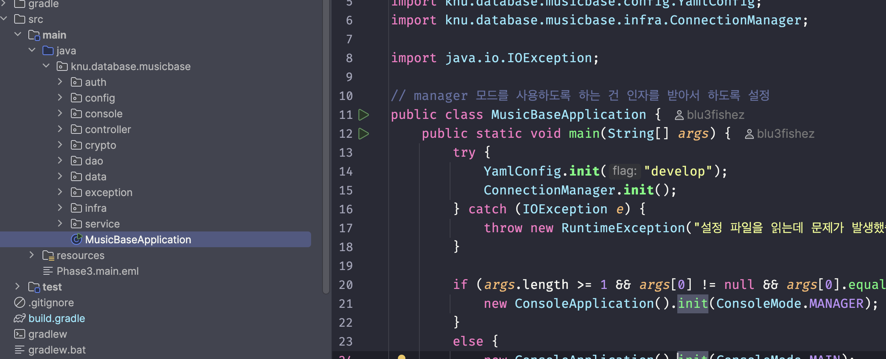

# Phase 3

[newquery20.sql](./docs/newquery20.sql)

[https://github.com/DBProjectTeam15/Phase3](https://github.com/DBProjectTeam15/Phase3)

### Java 권장 버전

이 프로젝트는 `JDK 17` 버전을 바탕으로 만들어졌습니다. 17버전 이상의 `jdk` 를 가지고 실행해주세요.

## 실행 방법

두가지 실행 방법이 있습니다.

1. 직접 `jar` 파일로 빌드하여 실행
2. IntelliJ IDEA 에서 실행

IDE 가 존재하지 않는 환경 특성상, 1번 방법을 권장드립니다. 

### 실행 이전 필수 설정 사항들

실행해보기 전에 중요한 점은, **Database 접속 URL** 설정이 별도로 필요하다는 점입니다.

`src/main/resources/application-develop.yaml` 파일의 내용을 수정해주세요. 해당되는 부분에 맞게 형식에 맞게 수정해주시면 됩니다.

```yaml
database:
  url: jdbc:oracle:thin:@localhost:1521:xe
  username: musebase
  password: musebase1234
```

### 스키마 정의 SQL 코드

저희가 데이터 시딩을 바로 JDBC 로 실행되게 만들지 못했습니다… 그래서 아래 실행 SQL 문을 별도로 실행해주시면 감사하겠습니다. 

추가적으로, 데이터 시딩하는 구문도 아래 스키마에 맞게 변경해두었습니다.

변경된 내용은 아래 `스키마 변경사항` 항목에서 확인 가능합니다.

```sql
DROP TABLE EDITS CASCADE CONSTRAINTS PURGE;
DROP TABLE ART_TYPES CASCADE CONSTRAINTS PURGE;
DROP TABLE CONSISTED_OF CASCADE CONSTRAINTS PURGE;
DROP TABLE COMMENTS CASCADE CONSTRAINTS PURGE;
DROP TABLE MADE_BY CASCADE CONSTRAINTS PURGE;
DROP TABLE ARTISTS CASCADE CONSTRAINTS PURGE;
DROP TABLE SONGS CASCADE CONSTRAINTS PURGE;
DROP TABLE PROVIDERS CASCADE CONSTRAINTS PURGE;
DROP TABLE SONG_REQUESTS CASCADE CONSTRAINTS PURGE;
DROP TABLE MANAGERS CASCADE CONSTRAINTS PURGE;
DROP TABLE PLAYLISTS CASCADE CONSTRAINTS PURGE;
DROP TABLE USERS CASCADE CONSTRAINTS PURGE;

CREATE TABLE USERS (
                       User_id NUMBER GENERATED ALWAYS AS IDENTITY PRIMARY KEY, -- 인조키에 AUTO GENERATED KEY 기능을 사용하게 하기 위해 변경했습니다.
                       Nickname VARCHAR2(30) NOT NULL,
                       Password VARCHAR2(255) NOT NULL, -- 여기랑, 관리자 비밀번호 부분을 255자로 늘렸습니다 (추후 해시를 저장하기 위함)
                       Email VARCHAR2(50) NOT NULL UNIQUE -- 기능 구현 중, 이메일로 로그인하도록 기능을 수정했습니다.
);

CREATE TABLE PLAYLISTS (
                           Playlist_id NUMBER GENERATED ALWAYS AS IDENTITY PRIMARY KEY, --
                           Title VARCHAR2(30) NOT NULL,
                           Is_collaborative VARCHAR2(10) NOT NULL,
                           User_id NUMBER NOT NULL REFERENCES USERS(User_id)
);

CREATE TABLE MANAGERS (
                          Manager_id VARCHAR2(30) PRIMARY KEY,
                          Password VARCHAR2(255) NOT NULL,
                          Name VARCHAR2(30) NOT NULL
);

CREATE TABLE SONG_REQUESTS (
                               Request_id NUMBER GENERATED ALWAYS AS IDENTITY PRIMARY KEY,
                               Request_song_title VARCHAR2(30) NOT NULL,
                               Request_at TIMESTAMP NOT NULL,
                               Request_song_artist VARCHAR2(30) NOT NULL,
                               User_id NUMBER REFERENCES USERS(User_id) NOT NULL,
                               Manager_id VARCHAR2(30) REFERENCES MANAGERS(Manager_id)
);

CREATE TABLE PROVIDERS (
                           Provider_id NUMBER GENERATED ALWAYS AS IDENTITY PRIMARY KEY,
                           Provider_name VARCHAR2(30) NOT NULL,
                           Provider_link VARCHAR2(255) NOT NULL
);

CREATE TABLE SONGS (
                       Song_id NUMBER GENERATED ALWAYS AS IDENTITY PRIMARY KEY,
                       Title VARCHAR2(120) NOT NULL,
                       Length NUMBER NOT NULL,
                       Play_link VARCHAR2(255) NOT NULL,
                       Create_at TIMESTAMP,
                       Provider_id NUMBER NOT NULL REFERENCES PROVIDERS(Provider_id)
);

CREATE TABLE ARTISTS (
                         Artist_id NUMBER GENERATED ALWAYS AS IDENTITY PRIMARY KEY,
                         Name VARCHAR2(30) NOT NULL,
                         Gender VARCHAR2(10)
);

CREATE TABLE MADE_BY (
                         Song_id NUMBER NOT NULL REFERENCES SONGS(Song_id),
                         Artist_id NUMBER NOT NULL REFERENCES ARTISTS(Artist_id),
                         Role VARCHAR2(30) NOT NULL,
                         PRIMARY KEY(Song_id, Artist_id, Role)
);

CREATE TABLE COMMENTS (
                          Comment_id NUMBER NOT NULL,
                          Content VARCHAR2(200) NOT NULL,
                          Commented_at TIMESTAMP NOT NULL,
                          User_id NUMBER NOT NULL REFERENCES USERS(User_id),
                          Playlist_id NUMBER NOT NULL REFERENCES PLAYLISTS(Playlist_id),
                          PRIMARY KEY (User_id, Playlist_id, Comment_id) -- 복합 키
);

CREATE TABLE CONSISTED_OF (
                              Playlist_id NUMBER NOT NULL REFERENCES PLAYLISTS(Playlist_id),
                              Song_id NUMBER NOT NULL REFERENCES SONGS(Song_id),
                              PRIMARY KEY (Playlist_id, Song_id)
);

CREATE TABLE ART_TYPES (
                           Artist_id NUMBER NOT NULL REFERENCES ARTISTS(Artist_id),
                           Artist_type VARCHAR2(30) NOT NULL,
                           PRIMARY KEY (Artist_type, Artist_id)
);

CREATE TABLE EDITS (
                       User_id NUMBER NOT NULL REFERENCES USERS(User_id),
                       Playlist_id NUMBER NOT NULL REFERENCES PLAYLISTS(Playlist_id),
                       PRIMARY KEY (User_id, Playlist_id)
);
```

### 데이터 시딩 SQL 파일

같이 첨부된 `data.sql` 파일이 있습니다. 별도로 첨부해두겠습니다.

[data.sql](./docs/data.sql)

### 1. JAR 빌드 및 실행

해당 프로젝트는 동봉된 `gradlew` 를 통해서 실행이 가능합니다.

```bash
./gradlew shadowJar
```

```bash
# 두 진입 모두 위에 언급된 설정파일에 맞는
# 오라클 DB 커넥션이 활성화되어있으며, 테이블 또한 설정되어 있어야 실행 가능합니다!

java -jar build/libs/MusicBase-1.0-SNAPSHOT-all.jar # main 앱 실행방법
java -jar build/libs/MusicBase-1.0-SNAPSHOT-all.jar manager # 관리자 앱 실행방법
```

### 2. IntelliJ IDEA 에서 실행

해당 프로젝트의 루트부분을 포함하는 폴더를 루트로 하여 열어주세요.

프로젝트 실행 방법은 두 방법으로 나뉩니다. 이렇게 설정해주세요.

1. 먼저, 메인 함수를 찾고, 실행버튼을 눌러 실행시켜주세요. 메인 함수는 아래 제시된 위치에 있습니다.



1. 이후, 메인 함수를 실행해주신 다음, 해당 설정을 복사해주세요. 우측 상단 위 `Edit Configurations...` 를 누르면 설정할 수 있습니다.


1. 해당 방법을 사용하여 관리자 앱을 실행할 수도 있습니다. Main 함수를 눌러 나온 기본 실행 옵션을 복사하시고, 복사는 `Edit Configuration` 을 누르셔서 나온 창 왼쪽 위에 복사 아이콘으로 복사할 수 있습니다. 그 이후 두번째 사진처럼 argument 항목에 `manager` 를 입력해주시면 됩니다.


## 앱 사용 방법

이 프로젝트는 두개의 진입 루트가 있습니다.

하나는 메인 앱, 다른 하나는 소위 말하는 관리자 페이지인데, `jar` 파일 실행 시 첫번째 인자로 별도의 인자 `manager` 를 추가해주면 수행이 가능합니다.


공통적인 조작법은 다음과 같습니다.

```bash
1. 지정된 숫자와 .으로 구별된 부분은 명령어를 수행할 수 있다는 뜻입니다.
	예를들어, 1. / 2. / 3. 으로 나타나있으면 해당부분은 사용할 수 있는 명령에 해당됩니다.
2. 명령은 해당되는 숫자를 누르고 엔터를 누르면 수행합니다. 
  예를들어, `0`를 입력하고 엔터를 누르면, 프로그램이 종료됩니다.
3. 그 다음은 공백을 구분하여 인자를 넣어야하는 부분이 있습니다.
  공통적으로 인자를 넣어야하는 부분에는 대괄호 표시가 되어있습니다.
  예를들어, 로그인을 하고싶다면 `1 User2@gmail.com password2` 를 누르면, 로그인됩니다.
```

## 메인 앱

메인 앱은 아래와 같은 기능을 지닙니다.

- 로그인 기능
    - 예시 : `User2@gmail.com password2` 로 로그인 가능
- 검색 기능
    - `검색 기능에서 필터 설정 초기화를 위해선 프로그램을 껐다 켜야 합니다..`
    - 플레이리스트, 악곡, 아티스트 검색 가능
    - 검색하기를 눌러서 검색 가능
- 플레이리스트 기능
    - 각각의 플레이리스트의 구성 악곡요소 확인기능
- 악곡수가 많은 상위 10개 플레이리스트 확인 기능
- 내 정보 확인 기능
    - 비밀번호, 닉네임 변경 기능
    - 계정 삭제 기능
        - `Cascade 옵션이 없어서, 악곡과 편집권한이 있으면 삭제 불가능`
        - 새롭게 추가된 유저만 가능
    - 로그인 되지 않았으면 진입 불가능
    - 내가 소유한 플레이리스트 확인
    - 공유 받은 (소유는 하지 않았지만, 편집권한이 있는) 플레이리스트 확인
    - 내가 작성한 댓글 확인

## 관리자 페이지

- 관리자 로그인 기능
    - 예시 : `2 M_PW1` 로 로그인 가능
- 악곡 요청 관리
    - 자신에게 온 요청 확인하기
    - 요청 삭제하기
    - `요청을 확인하고 데이터베이스에 직접 넣어주고 요청을 삭제해주는 구조`로 상정 했습니다.
- 제공원 관리
    - 제공원 추가 기능
    - 제공원 삭제 기능
- 아티스트 관리
    - 모든 아티스트들을 확인 가능
    - 아티스트 추가 및 삭제 가능

## 스키마 변경사항

대표적으로 변경된 사항 몇개만 설명하겠습니다.

- `GENERATED ALWAYS AS IDENTITY` 추가 :
    - 인조키 추가 시 안정성을 위하여 자동적으로 데이터베이스에서 할당하도록 하였습니다. 매번 트랜잭션을 걸필요 없고, 중간에 키 삭제 시 동일한 키값으로 다른 엔티티를 바라보는 현상을 방지하였습니다.
- `MANAGERS`, `USERS` 의 `PASSWORD` 정의 변경 : 최대 255자
    - 추후 패스워드의 해시값만 저장하게 하기 위해서 지정된 글자수를 늘렸습니다.
- `USERS.EMAIL` : `UNIQUE` 제약조건 추가
    - 로그인을 이메일로 하도록 하기 위함

## 사용된 쿼리 10개

데이터베이스에 직접 접속하여 쿼리를 사용하고 데이터를 처리하는 부분은 `DataAccesObject` 계층에 모아두었습니다. 사용된 쿼리를 찾아보시려면 `쿼리` 라고 프로젝트 내에서 검색하시면 찾아보기 편하실 겁니다.

1. `CommentDAO.java`
`findByPlaylistWithAuthor` 메서드 : 쿼리 8.1 활용
    
    ```sql
    -- 사용된 쿼리
    SELECT U.Nickname, C.Content, C.Commented_at
    FROM COMMENTS C
    JOIN USERS U ON C.User_id = U.User_id
    WHERE C.Playlist_id = ?
    ORDER BY C.Commented_at DESC;
    ```
    
    ```sql
    -- 기존 쿼리
    SELECT C.Content, U.Nickname, C.Commented_at
    FROM COMMENTS C
    JOIN USERS U ON C.User_id = U.User_id
    WHERE C.Playlist_id = 10000058
    ORDER BY C.Commented_at DESC;
    ```
    
    변경 사항 : SELECT 항목 순서 변경
    
2. PlaylistDAO.java
`top10BySongCountOrderByDESCAndSet` 메서드 : 쿼리 9.2 활용
    
    ```sql
    -- 사용된 쿼리
    SELECT * FROM (
    	SELECT
    		P.Playlist_id,
    		P.Title,
    		P.Is_collaborative,
    		P.User_id,
    		COUNT(C.Song_id) AS Song_Count
    	FROM PLAYLISTS P
    	LEFT JOIN CONSISTED_OF C ON P.Playlist_id = C.Playlist_id
    	GROUP BY P.Playlist_id, P.Title, P.Is_collaborative, P.User_id
      ORDER BY Song_Count DESC
    ) P_SORTED
    WHERE ROWNUM <= 10
    ```
    
    ```sql
    -- 기존 쿼리
    SELECT P.Title, COUNT(C.Song_id) AS Song_Count
    FROM PLAYLISTS P
    JOIN CONSISTED_OF C ON P.Playlist_id = C.Playlist_id
    GROUP BY P.Title, P.Playlist_id -- Title이 중복될 수 있으므로 ID 포함
    ORDER BY Song_Count DESC;
    ```
    
    변경 사항 : 
    SELECT 항목을 전체 컬럼으로 변경
    SELECT 절에 추가된 모든 비집계 컬럼을 GROUP BY 절에 포함하여 그룹핑 기준을 확장
    조인 방식을 JOIN → LEFT JOIN으로 변경
    
    곡 수가 가장 많은 상위 10개 플레이리스트만 조회하도록 제한
    
    복잡한 정렬 및 집계 후 최종 결과를 제한하기 위해 서브쿼리 형태로 감쌈
    
3. ArtistDAO.java
    
    countArtists 메서드 : 쿼리 2번,3번 타입 활용
    
    ```sql
    -- 사용중인 쿼리
    SELECT COUNT(DISTINCT a.Artist_id) AS total_count 
    FROM ARTISTS a 
    LEFT JOIN ART_TYPES at ON a.Artist_id = at.Artist_id
    WHERE UPPER(at.Artist_type) IN placeholders;
    ```
    
    변경 사항 : 집계 함수, JOIN을 사용해 사용자가 입력한 다양한 검색 조건에 일치하는 아티스트의 수를 세는 기능으로 변경
    
4. [UserDAO.java](http://UserDAO.java) 
    
    findById 메서드 : 쿼리 1.1 활용
    
    ```sql
    -- 사용중인 쿼리
    SELECT User_id, Nickname, Password, Email 
    FROM USERS 
    WHERE User_id = ?
    ```
    
    ```sql
    -- 기존 쿼리
    SELECT Nickname, Email
    FROM USERS
    WHERE User_id = 10000001;
    ```
    
    변경 사항 : SELECT 항목에 User_id 컬럼 추가
    
5. PlaylistDAO.java
    
    findByUserId 메서드 : 쿼리 1.4 활용
    
    ```sql
    -- 사용중인 쿼리
    SELECT * 
    FROM PLAYLISTS 
    WHERE User_id = ?
    ```
    
    ```sql
    -- 기존 쿼리
    SELECT *
    FROM PLAYLISTS
    WHERE User_id = 10000001;
    ```
    
    변경 사항 : X
    
6. PlaylistDAO.java
    
    `findPlaylistDetailsByPlaylistId` 메서드 : 쿼리 2.1 활용
    
    ```sql
    -- 사용중인 쿼리
    SELECT S.SONG_ID, S.TITLE AS SONG_TITLE, S.PLAY_LINK, A.NAME AS ARTIST_NAME
    FROM CONSISTED_OF CO
    JOIN SONGS S
    ON CO.SONG_ID = S.SONG_I
    LEFT JOIN MADE_BY MB
    ON S.SONG_ID = MB.SONG_ID AND MB.ROLE = 'Singer'
    LEFT JOIN ARTISTS A ON MB.ARTIST_ID = A.ARTIST_ID
    WHERE CO.PLAYLIST_ID = ?
    ```
    
    ```sql
    -- 기존 쿼리
    SELECT S.Title, S.Play_link
    FROM PLAYLISTS P, CONSISTED_OF C, SONGS S
    WHERE P.Playlist_id = 10000021
      AND P.Playlist_id = C.Playlist_id
      AND C.Song_id = S.Song_id;
    ```
    
    변경사항:
    
    SELECT 대상 컬럼 및 FROM, WHERE 절의 범경
    
    LEFT JOIN 사용해 명시적 조인으로 변경
    
7. SongDAO.java
    
    countSongs 메서드 : 쿼리 9번 타입 활용
    
    ```sql
    -- 사용중인 쿼리
    SELECT COUNT(DISTINCT s.Song_id) AS total_count
    FROM SONGS s
    LEFT JOIN PROVIDERS p ON s.Provider_id = p.Provider_id
    LEFT JOIN MADE_BY mb ON s.Song_id = mb.Song_id
    LEFT JOIN ARTISTS a ON mb.Artist_id = a.Artist_id
    ```
    
    변경 사항 : 집계 함수와 JOIN을 사용해 전체 고유한 곡의 개수를 세는 기경
    
8. PlaylistDAO.java
    
    findEditable 메서드 : 쿼리 10.3 활용
    
    ```sql
    -- 사용중인 쿼리
    SELECT Playlist_id, Title, Is_collaborative, User_id
    FROM PLAYLISTS
    WHERE User_id = ?
    UNION
    	SELECT P.Playlist_id, P.Title, P.Is_collaborative, P.User_id
    	FROM PLAYLISTS P
    	JOIN EDITS E ON P.Playlist_id = E.Playlist_id
    	WHERE E.User_id = ?";
    ```
    
    ```sql
    SELECT Playlist_id, Title FROM PLAYLISTS WHERE User_id = 10000002
    UNION
    -- 편집 권한이 있는 플레이리스트
    	SELECT P.Playlist_id, P.Title
    	FROM PLAYLISTS P
    	JOIN EDITS E ON P.Playlist_id = E.Playlist_id
    	WHERE E.User_id = 10000002;
    ```
    
    변경 사항 : SELECT 항목 변경
    
9. ArtistDAO.java
    
    searchArtist 메서드 : 쿼리 6번 타입 활용
    
    ```sql
    SELECT DISTINCT a.Artist_id, a.Name, a.Gender
    FROM ARTISTS a
    LEFT JOIN ART_TYPES at ON a.Artist_id = at.Artist_id
    WHERE UPPER(at.Artist_type) IN ( ? );
    ```
    
    변경 사항 : 사용자가 선택한 아티스트 타입에 속하는 아티스트 명단을 얻기 위해 6번 타입의 쿼리문을 변경해 활용
    
10. PlaylistDAO.java
    
    `findSharedPlaylistsByUserId` 메서드 : 쿼리 2.3
    
    ```sql
    -- 사용중인 쿼리
    SELECT P.PLAYLIST_ID, P.TITLE, P.IS_COLLABORATIVE, P.USER_ID
    FROM PLAYLISTS P
    JOIN USERS U ON P.USER_ID = U.USER_ID
    JOIN EDITS E ON P.PLAYLIST_ID = E.PLAYLIST_ID
    WHERE E.USER_ID = ? AND P.USER_ID != ?
    ```
    
    ```sql
    -- 기존 쿼리
    SELECT P.Playlist_id, P.Title, P.User_id AS Owner_User_id
    FROM PLAYLISTS P, EDITS E
    WHERE E.User_id = 10000002
    AND E.Playlist_id = P.Playlist_id;
    ```
    
    변경사항 : 
    SELECT 대상 변경 (공동 편집 가능여부 추가)
    검색 조건경 (편집 가능한 모든 곡 조회 > 본인이 소유하지 않은 편집 가능한 모든 곡 조회)